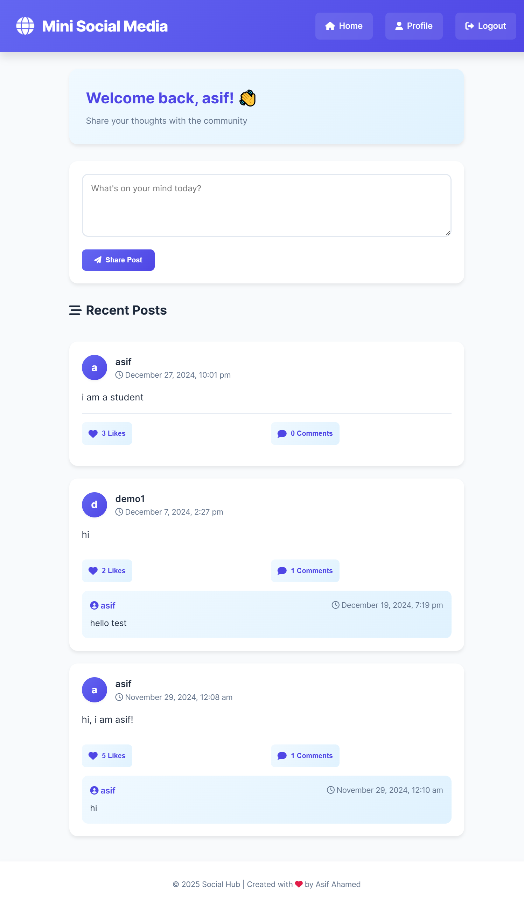
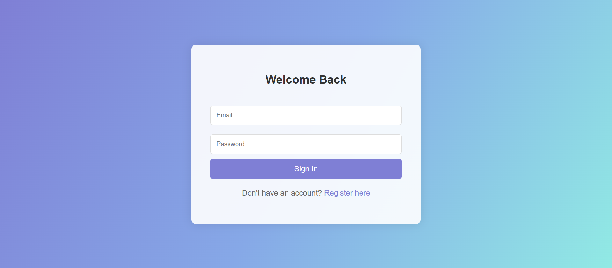
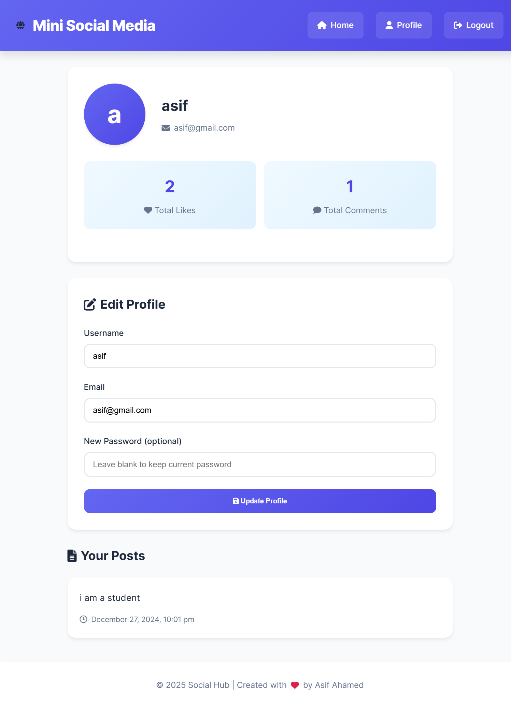
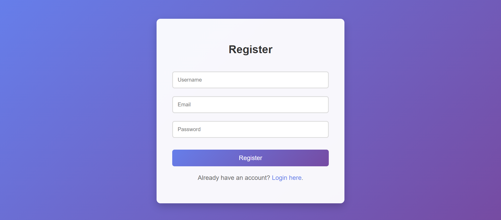

# MiniSocialMedia

MiniSocialMedia is a web-based social media application developed as part of the **E-Commerce and Web Programming Lab** in the 5th semester of the CSE curriculum. It includes features like user authentication, profile management, post creation, and interactive functionalities like likes and comments.

## Features

- **User Registration & Login**: Secure user authentication with encrypted passwords.
- **Profile Management**: Update and manage personal information.
- **Post Creation and Display**: Create and view posts on a social feed.
- **Like and Comment Functionality**: Engage with posts by liking and commenting.
- **Session Management**: Maintain user sessions effectively.

## Technology Stack

- **Frontend**: HTML, CSS, JavaScript
- **Backend**: PHP
- **Database**: MySQL

## Project Structure

```plaintext
MiniSocialMedia/
├── create_post.php       # Handles post creation
├── db.php                # Database connection setup
├── home.php              # Home page displaying posts
├── index.php             # Entry point (Login page)
├── like_comment.php      # Like and comment functionality
├── logout.php            # Session logout
├── minismp.sql           # SQL script to set up the database
├── profile.php           # User profile management
├── register.php          # User registration
├── update_profile.php    # Update profile details
└── SS/                   # Screenshots of the application
    ├── Home.png
    ├── login.png
    ├── Profile.png
    └── Register.png
```

## Database Design

### Users Table
| Column Name | Data Type      | Description                           |
|-------------|----------------|---------------------------------------|
| Id          | INT (PK, AI)   | Unique ID for each user              |
| Username    | VARCHAR(255)   | Username                             |
| Email       | VARCHAR(255)   | Email                                |
| Password    | VARCHAR(255)   | Encrypted Password                   |

### Posts Table
| Column Name  | Data Type      | Description                          |
|--------------|----------------|--------------------------------------|
| Id           | INT (PK, AI)   | Unique post ID                      |
| User_id      | INT (FK)       | Foreign key (Users)                 |
| Content      | TEXT           | Post content                        |
| Created_at   | DATETIME       | Post creation time                  |

### Likes Table
| Column Name  | Data Type      | Description                          |
|--------------|----------------|--------------------------------------|
| Id           | INT (PK, AI)   | Unique like ID                      |
| User_id      | INT (FK)       | Foreign key (Users)                 |
| Post_id      | INT (FK)       | Foreign key (Posts)                 |

### Comments Table
| Column Name  | Data Type      | Description                          |
|--------------|----------------|--------------------------------------|
| Id           | INT (PK, AI)   | Unique comment ID                   |
| User_id      | INT (FK)       | Foreign key (Users)                 |
| Post_id      | INT (FK)       | Foreign key (Posts)                 |
| Content      | TEXT           | Comment content                     |
| Created_at   | DATETIME       | Comment creation time               |

## Screenshots

### Home Page


### Login Page


### Profile Page


### Register Page


## How to Run the Project

1. Clone this repository:
   ```bash
   git clone https://github.com/asifahamed11/MiniSocialMedia.git
   ```
2. Import the `minismp.sql` file into your MySQL database.
3. Update the database credentials in `db.php`.
4. Place the project folder in your local web server's root directory (e.g., `htdocs` for XAMPP).
5. Start your web server and access the application at `http://localhost/MiniSocialMedia`.

## Acknowledgements

This project was developed as part of the **E-Commerce and Web Programming Lab** coursework in the **5th Semester, CSE Department**.

## License

This project is licensed under the MIT License. Feel free to use, modify, and distribute it as per the license terms.
